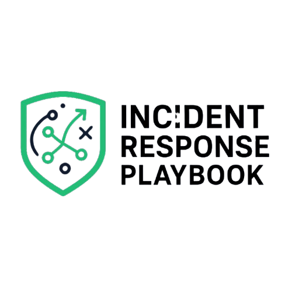

Jordan Fields  
Expected Graduation: December 2025  

  
<i class="fas fa-envelope"></i> <a href="mailto:fieldsjay33195@gmail.com">fieldsjay33195@gmail.com</a>

  
<i class="fab fa-github"></i> <a href="https://github.com/sitdownwithme" target="_blank">GitHub</a>

# Welcome to My Portfolio  

Hi, I’m **Jordan Fields** 👋🏾 — a lifelong learner and aspiring **SOC Analyst** currently studying at DAE. Guided by faith and purpose, I’m building hands-on skills in **cybersecurity, incident response, and security operations**.  

On this site, you’ll find:  
- **About Me** → My background, values, and career aspirations.  
- **Projects** → Hands-on cybersecurity labs and simulations I’ve built, including my **Incident Response Playbook**, **Sports Connect**, and my **Law Enforcement SOC (Mini SOC Capstone)**.  
- **Updates** → Reflections, progress, and lessons I’m learning along the way.  

I want this portfolio to feel welcoming — a place where you can see my work, my growth, and my commitment to becoming an excellent SOC analyst.  

---

## Featured Projects  

  
  <h3>Incident Response Playbook</h3>
  
A cybersecurity lab simulating ransomware attacks and practicing full-cycle incident response using SIEM, Wazuh, and forensic documentation.

  <a href="/projects/#Incident Response PlayBook" class="btn btn--primary">View Details</a>

  
  <h3>Sports Connect</h3>
  
A web application with <strong>user authentication and database security features</strong>, giving me early experience in access control and secure design.

  <a href="/projects/#Sports Connect" class="btn btn--primary">View Details</a>

  
  <h3>Law Enforcement SOC (Mini SOC Capstone)</h3>
  
A combined Security Operations Center project inspired by law enforcement workflows. Built to simulate SIEM dashboards, custom detection rules, and incident response playbooks, while documenting investigations with chain-of-custody style case reports.

  <a href="/projects/#Law Enforcement SOC Capstone" class="btn btn--primary">View Details</a>

---

  

