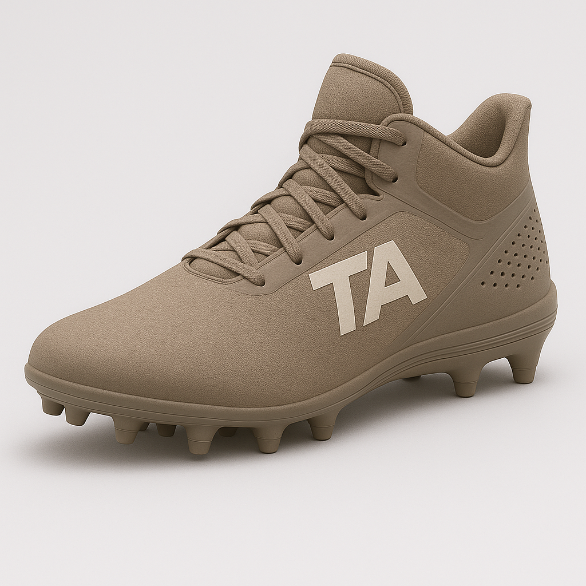

  

    
  

  
  

    <h1>Jordan Fields</h1>
    
Expected Graduation: December 2025

    
    

      
<i class="fas fa-envelope"></i> <a href="mailto:fieldsjay33195@gmail.com">fieldsjay33195@gmail.com</a>

      
<i class="fab fa-github"></i> <a href="https://github.com/sitdownwithme" target="_blank">GitHub</a>

    

  

  <h2>Welcome to My Portfolio</h2>
  
I'm a passionate developer currently studying at DAE. I'm focused on building innovative solutions that make a difference.

  
  

    <a href="/about/" class="btn btn--primary">Learn About Me</a>
    <a href="/projects/" class="btn btn--secondary">View My Projects</a>
  

  <h2>Featured Projects</h2>
  
  

    

      
      <h3>Incident Response Playbook</h3>
      
A comprehensive incident response solution for protecting valuable data.

      <a href="/projects/#Incident Response PlayBook" class="btn btn--primary">View Details</a>
    

    
    

      
      <h3>ToddAvery Shoe Customizer</h3>
      
Interactive application for customizing lacrosse shoes with various options.

      <a href="/projects/#ToddAvery Shoe Customizer" class="btn btn--primary">View Details</a>
    

    
    

      
      <h3>Sports Connect</h3>
      
Brief description of the project and technologies used.

      <a href="/projects/#Sports Connect" class="btn btn--primary">View Details</a>
    

  

  

