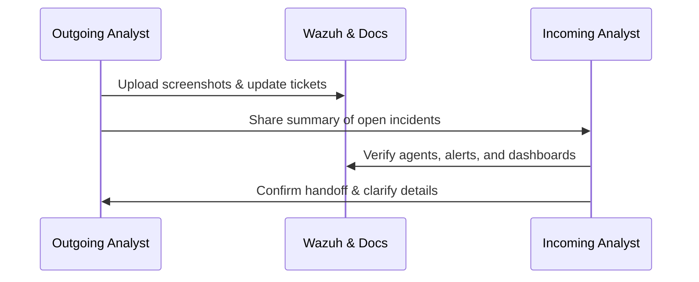

# Security Operations Center 1

# ✅ Law Enforcement SOC Project – Rubric Completion Checklist

---

## 1. **Prepare SOC Operations Documentation**
**Goal:** Demonstrate full understanding of SOC tools, workflows, and operations.  
**Status:** 🟢 *Marked Complete (pending structure + diagram confirmation)*  

### Checklist
- [x] Folder named **`security_operations_center_1`** created and all project files moved inside.  
- [x] Clearly explained purpose and function of **SOC tools**:
  - [x] SIEM (Wazuh)
  - [x] Monitoring (Wazuh Dashboard)
  - [x] Ticketing/Tracking (Monday.com reference)
- [x] Documented **SOC workflow** using a **Mermaid alert-handling diagram**.  
- [x] Included **Shift Transition Procedures** and **handover requirements**.  
- [x] Added **Incident Handling Steps** using your incident template.  
- [x] Embedded **screenshots** of Wazuh dashboards, alerts, and agent activity.  
- [ ] Double-check Mermaid diagram shows *alert flow → triage → escalation → resolution*.  
- [ ] Confirm all screenshots are centered and labeled clearly.

---

## 2. **Document SIEM Implementation**
**Goal:** Explain SIEM architecture, data flow, log sources, correlation rules, and notifications.  
**Status:** 🟢 *Marked Complete (pending structure + screenshots)*  

### Checklist
- [x] Included **SIEM architecture diagram** (Mermaid).  
- [x] Explained **Wazuh Manager**, **Indexer**, and **Dashboard** relationships.  
- [x] Added **sample correlation rule** in `local_rules.xml` (SSH brute-force detection).  
- [x] Documented **rule logic explanation** in README.  
- [x] Identified **at least 3 log sources** and explained their **monitoring significance**:
  - [x] Authentication logs (`/var/log/auth.log`)
  - [x] File Integrity Monitoring (FIM)
  - [x] Netstat Port Monitoring  
- [x] Added **notification settings** configuration (email or Slack).  
- [x] Screenshot of **Wazuh Integrations → Notifications** page.  
- [ ] Confirm screenshots and diagram are inside `/docs/screenshots` and `/docs/diagrams`.

---

## 3. **Document Threat Detection Principles**
**Goal:** Show understanding of detection mechanisms, indicators, scenarios, and investigations.  
**Status:** 🟢 *Marked Complete (pending structure + expanded details)*  

### Checklist
- [x] Explained **how Wazuh rules and decoders** detect threats.  
- [x] Described **threat indicator categories**:
  - [x] Network IOCs  
  - [x] Authentication IOCs  
  - [x] File Integrity IOCs  
  - [x] System Posture (CIS Benchmark)  
- [x] Documented **3 Detection Scenarios**:
  - [x] SSH Brute Force  
  - [x] Netstat Port Change  
  - [x] File Integrity Violation  
- [x] Outlined **structured threat analysis methodology** (Detection → Validation → Containment → Eradication → Recovery → Lessons Learned).  
- [x] Completed **Alert Investigation Exercise** (“Listened Ports Changed” case).  
- [x] Mapped alerts to **MITRE ATT&CK tactics** (Defense Evasion, Privilege Escalation, Persistence).  
- [ ] Add screenshots of MITRE ATT&CK and alert list views from your dashboard.

---

## 4. **Document Incident Response Methodology**
**Goal:** Demonstrate understanding of IR process, escalation, and documentation flow.  
**Status:** 🟡 *Pending verification*  

### Checklist
- [x] Created and completed **Incident Response Plan (IRP)** document.  
- [x] Defined **Initial Response Protocol** for one incident type (Netstat/SSH).  
- [x] Described **Case Management System** components (alerts → triage → tracking).  
- [x] Outlined **Incident Escalation Criteria**:
  - [x] Critical = immediate SOC action.  
  - [x] Medium = logged and monitored.  
  - [x] Low = reviewed weekly.  
- [x] Documented **communication protocols and decision points**.  
- [x] Used **Incident Response Template** from coursework.  
- [ ] Attach relevant **screenshots** of dashboard alerts and resolved case evidence.  
- [ ] Verify all IR materials live under `/docs/` or `/evidence/`.

---

## 5. **Final Verification**
Before submission, confirm all rubric items are satisfied:

### Folder & Structure
- [x] All files reside in `/security_operations_center_1/`.  
- [x] Folders `/docs`, `/docs/screenshots`, `/docs/diagrams`, `/evidence`, `/wazuh` created.

### Documentation
- [x] Two README files added:
  - [x] `README_SOC_Implementation.md`
  - [x] `README_Threat_Detection_Response.md`
- [x] Mermaid diagrams created and exported to `.mmd` or `.png`.  
- [x] Screenshots centered and properly labeled in documents.  
- [x] IRP, Defense Strategy, Policy Framework added under `/docs/`.

### Evidence
- [x] Investigation report added in `/evidence/`.  
- [x] Notification test results saved.  
- [x] CIS scan and MITRE ATT&CK screenshots included.

---

✅ **When all boxes are checked**, your project will meet *every required element* from the course rubric and instructor feedback.

# 🧠 Law Enforcement SOC – Operations Documentation

## Overview
This document explains how the Law Enforcement SOC operates using **Wazuh** as the primary SIEM platform.  
It includes documentation of SOC workflows, alert escalation paths, shift handoff procedures, and the incident handling process required by the rubric.

---

## 1. Essential SOC Tools
| Tool | Function | Purpose in Project |
|------|-----------|--------------------|
| **Wazuh SIEM** | Centralized monitoring and log analysis | Detects and correlates security events. |
| **Docker Desktop** | Containerized environment for Wazuh stack | Hosts the manager, indexer, and dashboard securely. |
| **Ubuntu 22.04 (WSL)** | Endpoint log source | Sends system, authentication, and file integrity data. |
| **Monday.com** | Task tracking / ticketing system | Used to document incidents, alerts, and shift notes. |

---

## 2. SOC Workflow & Alert Handling (Mermaid Diagram)




---

## ⚙️ **README #2 – `README_SIEM_Implementation.md`**

```markdown
# ⚙️ Law Enforcement SOC – SIEM Implementation & Architecture

## Overview
This document details the technical implementation of the Wazuh SIEM within the Law Enforcement SOC environment.  
It includes SIEM architecture components, data flow, correlation rule logic, monitored log sources, and notification settings configuration.

---

## 1. SIEM Architecture
The SOC uses a **Docker single-node deployment** with three key containers:
1. **Wazuh Manager** – Processes and correlates alerts from agents.  
2. **Wazuh Indexer** – Stores log data and enables search capabilities.  
3. **Wazuh Dashboard** – Displays real-time events and analytics.

### Architecture Diagram
```mermaid
flowchart LR
  subgraph Endpoints
    WSL[Ubuntu 22.04 (WSL) – Wazuh Agent]
    WIN[Windows Host (optional agent)]
    PARROT[Parrot OS (optional attacker sim)]
  end

  subgraph Wazuh_on_Docker
    MGR[Wazuh Manager]
    IDX[Wazuh Indexer]
    DASH[Wazuh Dashboard (https://localhost:443)]
  end

  WSL -->|Auth / Syslog / FIM| MGR
  WIN -->|Winlog Events| MGR
  PARROT -->|Simulated Probes| WSL

  MGR --> IDX
  IDX --> DASH
  DASH --> YOU[[SOC Analyst]]


